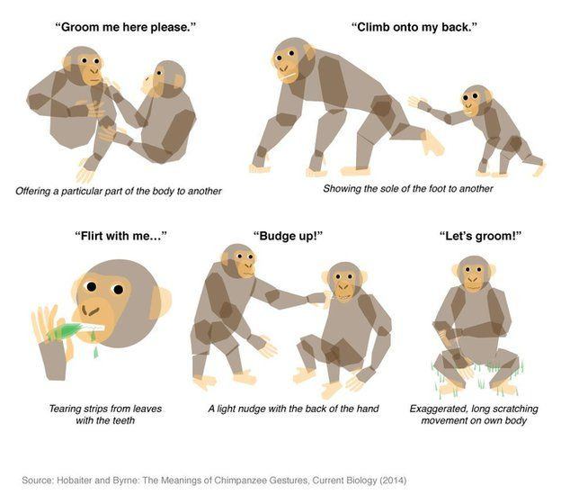

# Human and Animal Communication

"Language" will be used to mean human communication

## Properties of language

Hocket (1960) presents a list of 13 design features of language:

1. Semanticity
2. Arbitrariness
3. Discreteness
4. Productivity
5. Displacement
6. ...

These features are not unique to human communication, but there is no known animal communication system that has all of them

### Semanticity

**Semanticity** means signals in the system have meaning

Language:

- has sounds and gestures
- words and their combinations have meaning

Animal communication:

- Vervet monkeys' alarms are specific sounds with specific meanings
  - sounds have specific responses:
    - eagle alarm - go to bushes/middle of trees
    - leopard alarm - go to treetop
    - snake alarm - stand up and survey ground
    - this is in contrast to how we can discuss hypothetical situations, or situations in the past or future
  - sounds cannot be combined to form other alarms
  - have an immediate referent - all refer to animal in field of view
- Chimpanzes have 19 specific messages and 66 gestures:
- Honeybees send complex messages to each other
  - start by climbing on another bee's back to get attention
  - use dance to give directions to discovered source of nectar
    - duration of dance corresponds to distance
    - angle of dance corresponds to direction with respect to sun
    - also detail quality, somehow
  - dance is accurate enough to give directions to nectar up to 6 km away
  - knowledge is *innate* - bees raised in isolation still know how to do dances (but not in same precision)
    - do not need to be taught
    - young bees need flying experience with other dancers to become accurate
    - (innatism is a very important concept in linguistics)

We see above that semantism is not unique to language!

- however in language, sounds can be combined, and things can be discussed abstractly, while this is not common for animals

### Arbitrariness

**Arbitrariness** means there is no connection between a sound and its meaning.

Language:

- most words are arbitrary
- onomatopoea is iconic, i.e. not arbitrary
  - varies across languages, so has some amount of arbitrariness
- arbitrariness exists in signed languages too, not just spoken ones
  - signed language is not iconic, i.e. a viewer could not figure out what a sign means just by looking at it

Animal communication:

- Vervet monkey alarms sounds are arbitrary
- chimpanzee gestures are arbitrary - no logical connection between showing sole of foot and "climb onto my back"

### Discreteness

**Discreteness** means messages in the communication system are made of smaller parts that can be combined rather than indivisible units

Language:

- human communication is characterized by discreteness
- languages can have suffixes, e.g.
  - add "s" to make a noun plural, like dog+s and cat+s
  - add "ful" or "less" to a noun to make an adjective about it
- words can be combined into phrases which can be combined into sentences

Animal communication:

- not characterized by discreteness
- animals cannot typically combine sounds and gestures

### Productivity

**Productivity** is producing and understanding messages never heard before.

Language:

- human communication is characterized by productivity

Animal communication:

- not really

### Displacement

**Displacement** is communicating about things that are not present.

Language:

- humans can communicate past, present, future events
- can discuss hopes, hypotheses

Animal communication:

- doesn't seem to be characterized by displacement
- e.g. vervet monkeys' alarms are all meant to be responded to immediately

### Summary

| Feature       | Language | Animal Communication |
| :------------ | :------: | :------------------: |
| Semanticity   |   Yes    |         Yes          |
| Arbitrariness |   Yes    |         Yes          |
| Discreteness  |   Yes    |         Yes          |
| Productivity  |   Yes    |          No          |
| Displacement  |   Yes    |          No          |

