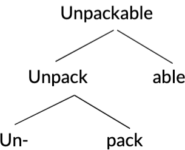
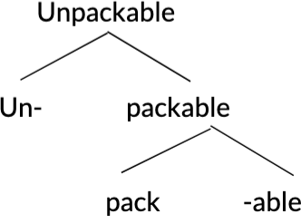

# Morphology

**Morphology** is the field of linguistics that studies how we form words (how morphemes are combined).

## Morphemes

**Morphemes** are parts of words that have meaning. A morpheme is a *meaningful minimal unit*.

For example, in "unbelievable", the morphemes are "un", "believ", and "able".

### Roots

There are two definitions of the **root** of a word:

- the part of the word that will remain when other parts are removed (Denham and Lobeck 2019)
  - they can often occur as independent words
- usually conveys the main meaning of the word (Mithun 2014)

For example, the root of "unbelievable" is "believe"

### Affixes

**Affixes** are morphemes that attach to other morphemes.

For example, "un" and "able" in "unbelievable" are affixes.

Affixes come in the following types:

- prefix
  - appear before the root
- suffix
  - appear after the root
- infix
  - appears inside the root
  - not very common in English but exists, e.g. "abso-frickin-lutely"
- circumfix
  - a single affix divided into two parts, before and after the root

## Morphological structures

The order in which morphemes are combined can change their meaning.

For example, "unpack-able" means that something is able to be unpacked, while "un-packable" means that something is not packable.

We can show morphological structures using word trees.

Here is the word tree for "unpack-able"

Here is the word tree for "un-packable"

## Compounds

**Compounds** are words that contain more than one root.

For example, some English compounds are "breakthrough", "hotdog"

### Blending

**Blending** is when two or more words are merged but they partially overlap/one is *clipped*.

In English:

- "brunch" = "breakfast" + "lunch"
- "motel" = "motor" + "hotel"

## Reduplication

**Reduplication** is when a new word is created by repeating a morpheme.

For example, in Warlpiri, reduplication is used for plurality. The word "kurdu" means child and "kurdukurdu" means children.

## Allomorphs

**Allomorphs** are alternate forms of a morpheme.

For example, in English plurality is expressed with the morpheme /s/. However, it is voiceless ([s]) when following a voiceless sound and voiced ([z]) when following a voiced sound, so the allomorphs of the morpheme /s/ are [s] and [z].